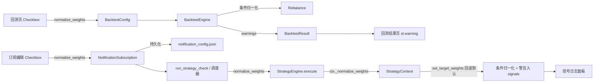

## 产品概述

在 quant_platform 中，把"权重归一化"作为**回测**与**策略信号检查**两个场景的可选项。保持默认开启以兼容现状；关闭后，策略返回的目标权重按字面值使用，支持部分持现金（sum < 100%），并在出现潜在杠杆（sum > 100%）时给出警告。

## 核心功能

### 回测侧

- `BacktestConfig` 新增 `normalize_weights` 字段（默认 True）。
- 回测引擎内部原先硬编码的归一化（`backtest/engine.py` 第 757-761 行）改为受此开关控制。
- 回测页侧边栏"回测设置"区新增"自动归一化权重"复选框；**仅当次生效，不持久化**。
- 关闭归一化且 `sum > 100.1%` 时，回测结果附带警告信息，结果页以 `st.warning` 展示。

### 信号检查侧

- `NotificationSubscription` 新增持久化字段 `normalize_weights: bool = True`，保存在 `notification_config.json`。
- 订阅编辑 UI 增加"自动归一化权重"复选框；每个订阅独立设置。
- 手动"检查信号"与后台调度器触发的自动检查均遵守订阅级开关。
- `StrategyEngine.execute()` 新增 `normalize_weights` 参数透传到 `StrategyContext`；`set_target_weights` 若未显式传 `normalize`，回退到上下文级默认值，保持策略代码的现有调用形态不变。
- 关闭归一化且 `sum > 100.1%` 时，`ctx.signals` 追加"可能产生杠杆敞口"警告，现有信号日志面板自动可见。

### 行为规则（已确认）

| 场景 | 行为 |
| --- | --- |
| 默认（开启归一化） | 与现状一致 |
| 关闭 + sum ≈ 100% | 原样使用，无警告 |
| 关闭 + sum > 100.1% | 按字面值执行，追加警告 |
| 关闭 + sum < 100% | 原样使用（持现金），无警告 |
| 关闭 + sum = 0 | 跳过本次调仓（复用现有保护逻辑） |


### 向后兼容

- 新字段默认均为 True，现有 `notification_config.json` 无需迁移（`from_dict` 对缺失字段用默认值兜底）。
- 现有 `BacktestConfig(...)` 调用处若未传新字段，行为不变。
- 现有策略代码 `ctx.set_target_weights(weights)` 保持完全兼容。

## 技术栈

沿用项目现有技术栈：Python + Streamlit + pandas + dataclass 配置模型；不新增依赖。

## 实现思路

### 高层策略

通过**三点最小侵入改动**实现两个场景的可选归一化：

1. **回测层**：`BacktestConfig` + 引擎内读取 flag；新增结果级 warning 通道（`BacktestResult.warnings`）。
2. **策略执行层**：`StrategyContext` 新增上下文级默认 `normalize_weights`；`set_target_weights(normalize=None)` 回退到上下文默认，保留策略代码内显式覆盖能力。
3. **订阅层**：`NotificationSubscription` 新增持久化字段，沿 `run_strategy_check → StrategyEngine.execute → StrategyContext` 透传；调度器路径复用同一入口。

### 关键技术决策

- **默认参数回退模式**：`set_target_weights(normalize: Optional[bool] = None)`，为 `None` 时使用 `self._normalize_weights`。既保持对旧策略代码的向后兼容（不传参走上下文默认），又不破坏策略作者显式传 `normalize=False/True` 的能力。
- **警告通道分层**：
- 回测侧：`BacktestResult` 新增 `warnings: List[str]`（若当前无此字段），引擎在 sum > 100.1% 时 append；UI 通过 `st.warning` 展示。
- 策略侧：复用现成 `ctx._signals`（已在结果中展示为"策略信号日志"），无需新字段，减少数据结构膨胀。
- **阈值 100.1%**：与现有 `set_target_weights` 的 `abs(total - 100) > 0.1` 判定一致，避免浮点噪声误警。
- **调度器一致性**：确保后台调度路径与手动检查复用同一套 `StrategyEngine.execute(normalize_weights=...)` 入口，防止双路径行为分叉。

### 性能与可靠性

- 所有改动为**控制流 + O(1) 判定**，无额外 I/O 与计算开销。
- 新字段兼容缺省值，`from_dict` 安全读取，避免反序列化失败。
- 警告使用受控字符串，不含 PII/价格细节，符合项目现有日志风格。

### 避免技术债

- 不新建独立归一化工具模块（复用现有 `StrategyContext.normalize_weights` 思路）。
- UI 复用现有 `st.checkbox` 模式，与"启用/禁用邮件通知"等订阅字段保持一致外观。
- 不触碰 `StrategyContext.set_target_weights` 的原有 `normalize` 参数语义，仅放宽到 `Optional[bool]`。

## 实现注意事项

- **调度器透传**：需先定位 `notification/` 下的调度器对 `strategy_engine.execute` 或 `run_strategy_check` 的调用点，确认其可访问 `subscription.normalize_weights`；若调度器走的是独立路径，需同步注入该参数。
- **`BacktestResult` 字段**：若现有 dataclass 无 `warnings` 字段，需同步修改其 `to_dict`/CSV 导出等方法（若存在），否则仅追加字段即可。
- **回测页 5 处 `BacktestConfig(...)` 构造**（大致位于 L190/237/350/396/532）需统一传入 `normalize_weights` 参数；建议把它提到"通用回测设置"变量块，避免 5 处漏传。
- **订阅编辑 UI 位置**：`ui/pages/notification_page.py` 需先定位订阅编辑/创建区块，在 `threshold_pct` 控件附近新增复选框；`NotificationSubscription` 创建/更新两条路径都要接收该字段。
- **缺省值兼容**：`NotificationSubscription.from_dict` 使用 `data.get('normalize_weights', True)`，确保旧 JSON 配置不崩。
- **警告展示**：回测结果页在现有结果渲染入口（成立时间预检附近/结果顶部）检查 `result.warnings` 并以 `st.warning` 展示；信号检查页依赖现有的"策略信号日志"展开面板，无需新 UI。
- **命名一致性**：UI 统一使用"自动归一化权重"标签，tooltip 说明"关闭后按字面权重执行，总和 <100% 视为持现金，>100% 产生杠杆警告"。

## 架构设计

### 数据流



### 模块职责

- `backtest/engine.py`：新增配置字段与结果警告；条件化归一化逻辑。
- `strategy/engine.py`：新增上下文级默认 + 执行器透传；警告写入 signals。
- `config/settings.py`：`NotificationSubscription` 新增持久化字段 + 序列化兼容。
- `ui/pages/backtest_page.py`：新增复选框 + 结果页警告渲染。
- `ui/pages/notification_page.py`：订阅编辑 UI 新增复选框 + 调用时透传。
- `notification/`（调度器）：调用点透传订阅级开关。

## 目录结构

```
quant_platform/
├── backtest/
│   └── engine.py                      # [MODIFY] 1) BacktestConfig 新增 normalize_weights: bool = True 字段；
│                                      # 2) BacktestResult 新增 warnings: List[str] = field(default_factory=list)（若未有）；
│                                      # 3) 回测主循环 L757-761 改为：若 config.normalize_weights 则按现有方式归一化；否则保留原 target_weights，但先过滤 sum>0 保护（sum=0 跳过调仓），sum>100.1 时向 result.warnings append 警告（仅当次调仓首次或按日期去重）；
│                                      # 4) 最终 BacktestResult 返回时携带 warnings。
├── strategy/
│   └── engine.py                      # [MODIFY] 1) StrategyContext.__init__ 新增 normalize_weights: bool = True 参数并存为 self._normalize_weights；
│                                      # 2) set_target_weights 签名改为 (weights, normalize: Optional[bool] = None)，内部 eff = self._normalize_weights if normalize is None else normalize；后续逻辑保持；关闭归一化且 abs(total-100)>0.1 且 total>100 时，self._signals.append("⚠️ 目标权重总和 {total:.1f}% > 100%，可能产生杠杆敞口")；sum < 100% 不警告；
│                                      # 3) StrategyEngine.execute 新增 normalize_weights: bool = True 参数，透传至 StrategyContext；
│                                      # 4) run_strategy_check 新增 normalize_weights 参数并透传。
├── config/
│   └── settings.py                    # [MODIFY] NotificationSubscription 新增字段 normalize_weights: bool = True；to_dict 增加键；from_dict 使用 data.get('normalize_weights', True) 兜底。
├── ui/pages/
│   ├── backtest_page.py               # [MODIFY] 1) 侧边栏"回测设置"区（调仓频率附近）新增 st.checkbox("自动归一化权重", value=True, key="bt_normalize_weights", help="关闭后按字面权重执行：<100% 持现金，>100% 警告")；
│                                      # 2) 将变量 normalize_weights 沿已有参数链（3 个 render_* 函数签名）透传；所有 BacktestConfig(...) 构造统一传入；
│                                      # 3) 结果渲染入口（如 render_backtest_results 顶部）检查 result.warnings 非空时 st.warning 展示。
│   └── notification_page.py           # [MODIFY] 1) 订阅编辑/创建 UI（threshold_pct 控件附近）新增 st.checkbox("自动归一化权重", value=subscription.normalize_weights, help=...)；创建/更新路径写回 subscription.normalize_weights；
│                                      # 2) run_strategy_check (L815) 调用 strategy_engine.execute 时传入 normalize_weights=subscription.normalize_weights。
└── notification/
    └── <scheduler>.py                 # [MODIFY if applicable] 调度器触发 run_strategy_check/StrategyEngine.execute 处透传 subscription.normalize_weights；具体文件在执行阶段按调用链定位。
```

## 关键接口定义

```python
# strategy/engine.py
class StrategyContext:
    def __init__(self, ..., normalize_weights: bool = True): ...
    def set_target_weights(
        self,
        weights: Dict[str, float],
        normalize: Optional[bool] = None,   # None → 回退 self._normalize_weights
    ) -> None: ...

class StrategyEngine:
    def execute(
        self, code: str, tickers: List[str],
        current_weights: Dict[str, float],
        current_date: date = None,
        lookback_days: int = 252,
        normalize_weights: bool = True,     # 新增
    ) -> StrategyResult: ...

# backtest/engine.py
@dataclass
class BacktestConfig:
    ...
    normalize_weights: bool = True          # 新增

@dataclass
class BacktestResult:
    ...
    warnings: List[str] = field(default_factory=list)   # 新增（若未有）

# config/settings.py
@dataclass
class NotificationSubscription:
    ...
    normalize_weights: bool = True          # 新增，持久化
```

## Agent Extensions

### SubAgent

- **code-explorer**
- Purpose: 在执行阶段定位 `notification/` 下的调度器实现文件与调用点，确认 `subscription.normalize_weights` 的透传路径；以及订阅编辑 UI 在 `notification_page.py` 中的具体区块。
- Expected outcome: 输出待改动文件的精确路径与行号范围，保证调度器与手动检查两条路径对齐，且订阅编辑 UI 改动点准确无遗漏。